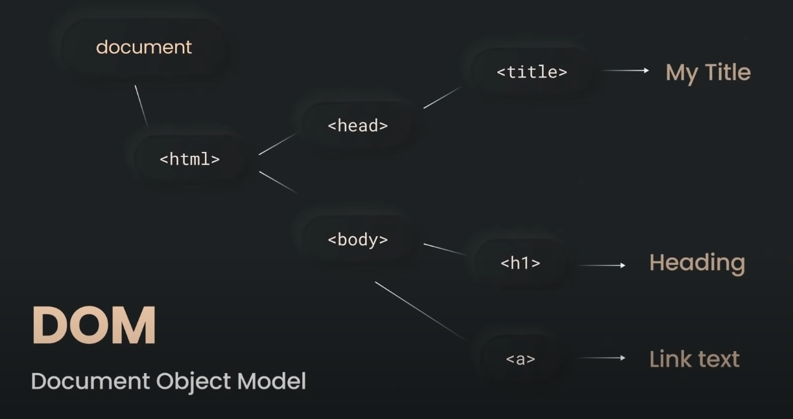
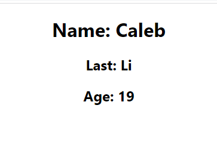
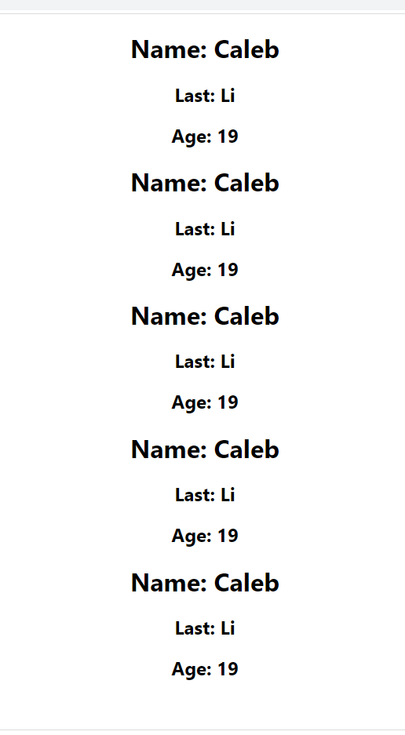
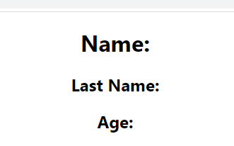
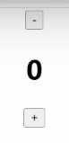
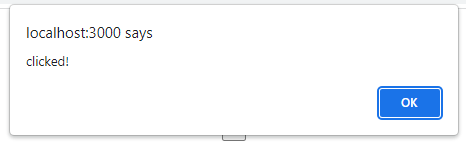
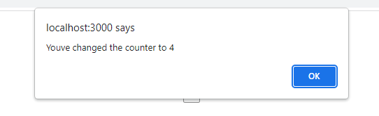

# React JS Guide
- React is one of the most widely used JS libraries
- In this guide, we will learn about React and how it utilizes JSX syntax, state, hooks, data fetching, and more
## But what exactly is React?
- React is a front end JavaScript library for building user interfaces
- In React, you do not need to reload the page. Everything works within a single HTML page. Very dynamic.

This is because While browsing the webpage, React updates what we see on a 
### **Document Object Model** 
 \
React uses Virtual DOM, a JS object that is much faster
- React only updates the section of the page where the change was made
React is a ***component based*** front end library
* All parts of web app are divided into smaller components
    - Each component is a small piece of the user interface
* Every react.js application is a tree of components:
    - independent and reuseable
    - combine it all to become a full fledged application

> for example, a website is split into smaller componenets
> * sidebar
> * searchbar
> * movies
>   - movie name
>   - ratings \
> think of it like a tree

## There are two types of components
Functional Components | Class-Based Components 
----- | --------
`import React from 'react'` | `import React { Component } from 'react'` 
used more frequently (the one we will use) | outdated 

We are importing React to be able to use the entirety of its library \ 
Both returns something react should display, for example `<div>Hello, React!<div>`\
Why are we returning HTML? \
This is *Stack Syntax* also known as JSX, which is used to describe what the user interface should look like.

# Setting Up
To get started, use create-react-app command. (You need node.js installed) This generates the files required to start React and run it in a browser, like a template.\
> `npx create-react-app ./` \
> This installs the primary react packages

> `npx start` \
> Runs the app on localhost3000

## Other files and folders
* *package.json* : file with all the dependencies & packages 
* *node_modules* : folder where the npm packages are installed
* *public* : folder containing one html file with an id of root. Everything is loaded onto that file
* *src* : important folder where all our logic is stored
    * *index.html* : file containing a single div with an id of `root`. All of our React components inside of this div. To explore that, we go into index.js
    * *index.js* : File and the starting point of every React application. Inside, there is `react-dom` which is used to reder our components & entire application into the real dom with a div with the id of `root`
    * *App.js* : a file where we have a functional component with code written in *JSX*. 

## JSX properties
#### this is done within App.js file
* `<div className = 'App'>` note that usually in html, you would write class, but it is a reserved keyword in JS so we use `className`
* Inside `{}`, you can put any JS expression. Very dynamic.
    - for example, `{2+2}` would turn out as 4 on the webpage.
    - like this, we can dynamically render larger blocks of code
* Rule of React: when rendering two different elements, one adjacent of other, you need to wrap it in a React fragment
    - React fragments are like an empty div:
    ``` JavaScript
        <>  //these are the react fragments
        <h1> Test </h1>
        <h2> There is no test </h2>
        </> // <---
    ```


# Components
We can create many components & import into larger components. Think of components like a function. \
Example,\
```JavaScript
    const Person = () => {
        return (
            <>
            <h1>Name: Caleb</h1>
            <h2>Last: Li</h2>
            <h2>Age: 19</h2>
            </>
        )
    }
```

You can inject this into App in App.js with the following:
```JavaScript
    const App = () => {
        return (
            <div className='App'>
                <Person />
            </div>    
        );
    }
```

Doing so, it shows up on the webpage like so:\
\
Like functions, we can use it multiple times:\
```JavaScript
    const App = () => {
        return (
            <div className='App'>
                <Person />
                <Person />
                <Person />
                <Person />
                <Person />
            </div>    
        );
    }
```

Outputs:\
\
#### Notice how they are all identical. What if we wanted they to output different things?
# Props
#### Every component has built in `props` object
Changing the code from before, we can use a placeholder instead of an actual name. So in the Person component we've created previously, \
```JavaScript
    const Person = (props) => {
    return (
    <>
      <h1>Name: {props.name}</h1>
      <h2>Last Name: {props.lastname}</h2>
      <h2>Age: {props.age}</h2>
    </>
    )
}
```

\
To populate each reference, within the App component,
```JavaScript
    <Person name={'John'} lastname={'Doe'} age={'30'}>
```
Note that `{}` are not necessary unless you are passing in a dynamic expression such as `{2+2}` \
Now we have duplicates, but different. Yay.

# State `import { useState } from 'react'`
#### State is a plain JS object used by React to represent a piece of information about the component's current situation. Completely managed by the component itself.
Don't forget to first import State before using it\
#### Whats the purpose of State?
Let's first create a counter. \
```JavaScript
    const App = () => {
        return (
            <div className='App'>
                <button>-</button>
                <h1>0</h1>
                <button>+</button>
            </div>
        );
    }
```
 \
Right now, if we click it nothing happens... \
to make something happen, we have to implement State within the App component.
```JavaScript
    const [counter, setCounter]  = useState(0);
```
- Whenever you call something as a function and starts with use, that is called a ***hook*** in React
- `[]` tells the name of the State. Rule of thumb, the second variable is the same as the first, but starts with set because it is a setter function for the first variable
- Inside of the useState, you provide its initial value. In this case, it is zero.

Let's reference it:
```JavaScript
    const App = () => {
        return (
            <div className='App'>
                <button>-</button>
                <h1>{counter}</h1>
                <button>+</button>
            </div>
        );
    }
```

Now we need to do an **event**. An **event** is an action triggered as a result of user action or system generated event (ie mouseclick).
```JavaScript
    <button onClick = { () => alert('clicked') }>-</button>
```

Every time you click the - button, an event will occur

- `alert('clicked')` is a callback function. No name, just waiting for a command.

So we want make it decrease by 1 every click on the - button.
```JavaScript
    <button onClick = { () => setCounter((prevCount) => prevCount - 1) }>-</button>
```
- We used a callback function within a callback function
- `prevCount` is a parameter for the current state. 

#### State is just one of the many 'hooks' used by React, another is useEffect.

# useEffect
### does something on some effect or event
```Javascript
    useEffect( () => {alert('Reload')}); //happens as soon as event occurs
```
- What if we put `counter = 100` instead of `alert('Reload')`
    - never modify state manually!
    - counter is NOt a normal variable, it is part of React state, which can only be changed with its own settle functions
    - use `setCounter(100)` instead. Sets the number counter to 100 at the start of each event.

To make it only happen once: \
```Javascript
    useEffect( () => {alert('Reload')}, []); 
```
- `[]` is a dependency array, set to be empty
    - Since it is empty, the value only gets set at the start because code is only going to happen at initial load of component.
- If we were to put `[counter]`, then code will update everytime counter changes.
    - pushing the button will cause an alert everytime \ 


